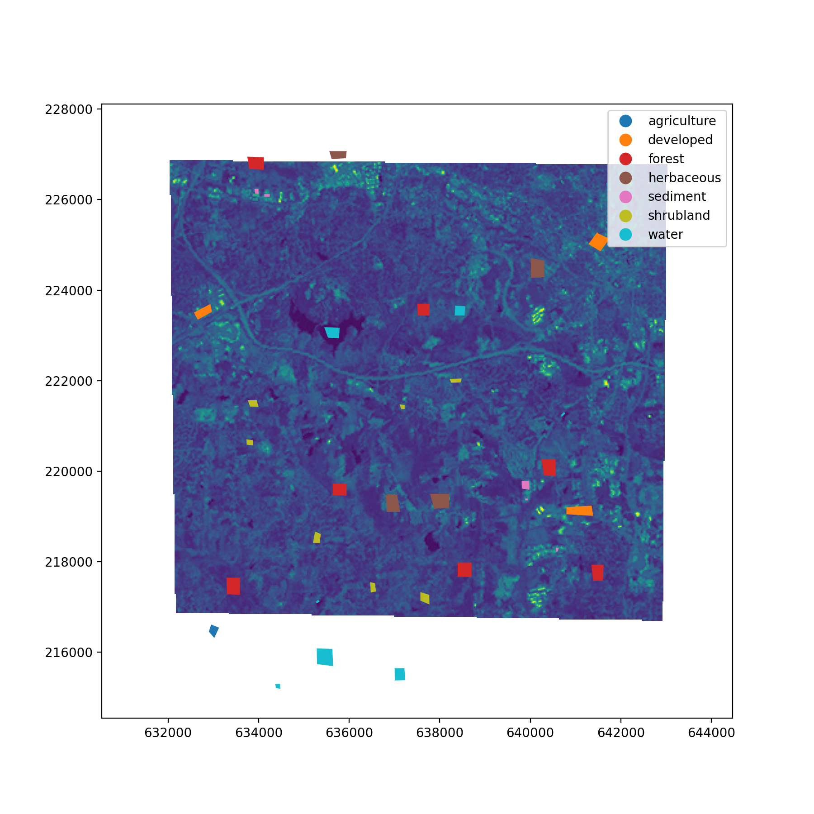
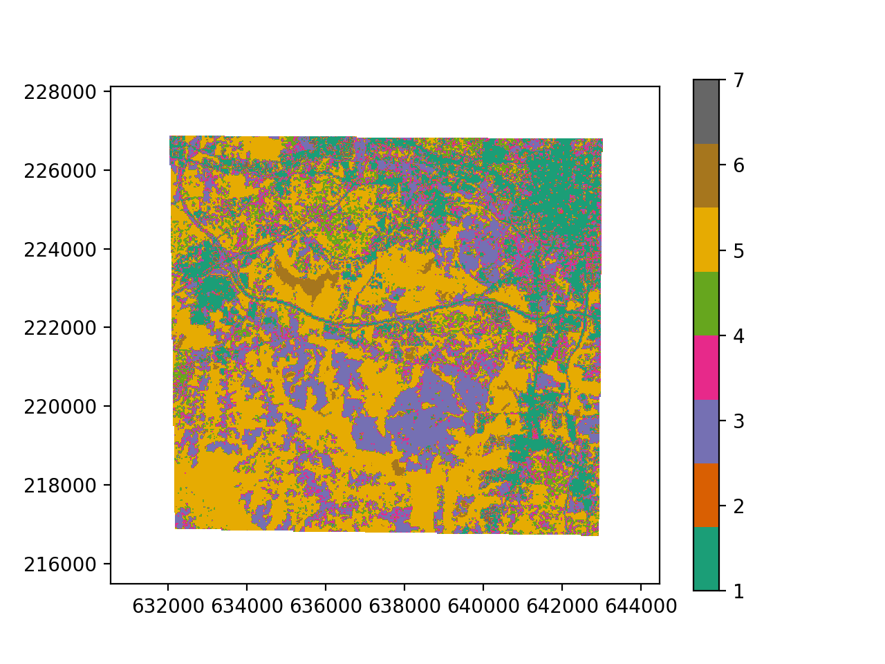
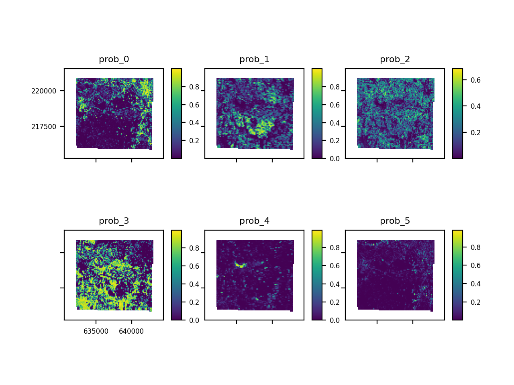

# A Machine Learning Example

## Extraction Training Data

Load some training data in the form of polygons, points and labelled pixels in
``geopandas.GeoDataFrame`` objects. We will also generate some line geometries
by converting the polygon boundaries into linestrings. All of these geometry
types can be used to spatially query pixel values in a Raster object, however
each GeoDataFrame must contain only one type of geometry (i.e. either shapely
points, polygons or linestrings).

```
from pyspatialml import Raster
from pyspatialml.datasets import nc
from copy import deepcopy
import os
import tempfile
import geopandas
import rasterio.plot
import matplotlib.pyplot as plt

training_py = geopandas.read_file(nc.polygons)
training_pt = geopandas.read_file(nc.points)
training_px = rasterio.open(nc.labelled_pixels)
training_lines = deepcopy(training_py)
training_lines['geometry'] = training_lines.geometry.boundary
```

Show training data points and a single raster band using numpy and matplotlib:

```
predictors = [nc.band1, nc.band2, nc.band3, nc.band4, nc.band5, nc.band7]
stack = Raster(predictors)

fig, ax = plt.subplots(figsize=(9, 9))
stack.lsat7_2000_70.plot(ax=ax)
training_py.plot(column="label", ax=ax, legend=True)
plt.show()
```



Pixel values in the Raster object can be spatially queried using the
`extract_vector` and `extract_raster` methods. In addition, the
`extract_xy` method can be used to query pixel values using a 2d array of x
and y coordinates.

The `extract_vector` method accepts a Geopandas GeoDataFrame as the
`gdf` argument. For GeoDataFrames containing shapely point geometries, the
closest pixel to each point is sampled. For shapely polygon geometries, all
pixels whose centres are inside the polygon are sampled. For shapely
linestring geometries, every pixel touched by the line is sampled. For all
geometry types, pixel values are queries for each geometry separately. This
means that overlapping polygons or points that fall within the same pixel with
cause the same pixel to be sampled multiple times.

By default, the extract functions return a Geopandas GeoDataFrame of point
geometries and the DataFrame containing the extracted pixels, with the column
names set by the names of the raster datasets in the Raster object. The user
can also use the `return_array=True` argument, which instead of returning a
DataFrame will return three masked numpy arrays (ids, X, xy) containing the
geodataframe index positions, extracted pixel values, and the spatial
coordinates of the sampled pixels. These arrays are masked arrays.

The `extract_raster` method can also be used to spatially query pixel values
from a Raster object using another raster containing labelled pixels. This
raster has to be spatially aligned with the Raster object. The values of the
labelled pixels are returned along with the queried pixel values.

```
# Extract data from rasters at the training point locations:
df_points = stack.extract_vector(training_pt)
df_polygons = stack.extract_vector(training_py)
df_lines = stack.extract_vector(training_lines)
```

For any vector features, a GeoDataFrame is returned containing the extracted
pixel values. A pandas.MultiIndex is used to relate the pixels back to the
original geometries, with the `pixel_idx` index referring to the index of each
pixel, and the `geometry_idx` referring to the index of the original geometry
in the supplied GeoDataFrame. The pixel values themselves are represented as
`shapely.geometry.Point` objects. These will need to be joined back with the
columns of the vector features to get the labelled classes. Here we will join
the extracted pixels using the "id" column and the GeoDataFrame index of the
vector features:

```
# Join the extracted values with other columns from the training data
df_points["id"] = training_pt["id"].values
df_points = df_points.dropna()
df_points.head()

df_polygons = df_polygons.merge(
    right=training_py.loc[:, ["label", "id"]], 
    left_on="geometry_idx", 
    right_on="index",
    right_index=True
)
```

If the training data is from labelled pixels in a raster, then the extracted
data will contain a "value" column that contains the pixel labels:

```
df_raster = stack.extract_raster(training_px)
```

## Model Training

Next we can train a logistic regression classifier:

```
from sklearn.linear_model import LogisticRegressionCV
from sklearn.preprocessing import StandardScaler
from sklearn.pipeline import Pipeline
from sklearn.model_selection import cross_validate

# define the classifier with standardization of the input features in a
# pipeline
lr = Pipeline(
    [('scaling', StandardScaler()),
        ('classifier', LogisticRegressionCV(n_jobs=-1))])

# remove NaNs from training data
df_polygons = df_polygons.dropna()

# fit the classifier
X = df_polygons.drop(columns=["id", "label", "geometry"]).values
y = df_polygons["id"].values
lr.fit(X, y)
```

After defining a classifier, a typical step consists of performing a
cross-validation to evaluate the performance of the model. Scikit-learn
provides the cross_validate function for this purpose. In comparison to
non-spatial data, spatial data can be spatially correlated, which potentially
can mean that geographically proximal samples may not represent truely
independent samples if they are within the autocorrelation range of some of the
predictors. This will lead to overly optimistic performance measures if samples
in the training dataset / cross-validation partition are strongly spatially
correlated with samples in the test dataset / cross-validation partition.

In this case, performing cross-validation using groups is useful, because these
groups can represent spatial clusters of training samples, and samples from the
same group will never occur in both the training and test partitions of a
cross-validation. Here we can use the polygon indices as the groups, i.e.
pixels within the same polygon will not be split into training and test
partitions:

```
scores = cross_validate(
    estimator=lr,
    X=X,
    y=y,
    groups=df_polygons.index.droplevel("pixel_idx"),
    scoring="accuracy",
    cv=3,
    n_jobs=1,
)
scores['test_score'].mean()
```

## Raster Prediction

Prediction on the Raster object is performed using the `predict` method.
The `estimator` is the only required argument. If the `file_path` argument
is not specified then the result is automatically written to a temporary file.
The predict method returns an rasterio.io.DatasetReader object which is open.

```
# prediction
result = stack.predict(estimator=lr, dtype='int16', nodata=0)
result_probs = stack.predict_proba(estimator=lr)

# plot classification result
result.iloc[0].cmap = "Dark2"
result.iloc[0].categorical = True
result.plot()
plt.show()
```



The `predict_proba` method can be used to output class probabilities as
a multi-band raster (a band for each class probability). In the latter case,
`indexes` can also be supplied if you only want to output the probabilities
for a particular class, or list of classes, by supplying the indices of those
classes:

```
# plot class probabilities
result_probs.plot()
plt.show()
```


