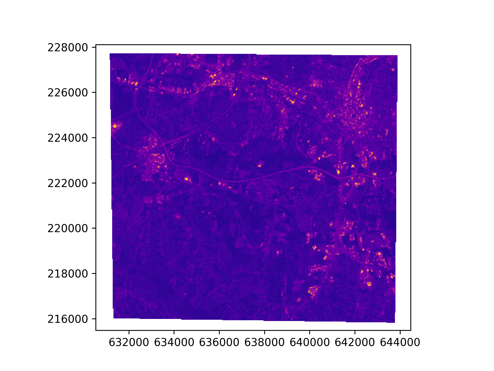
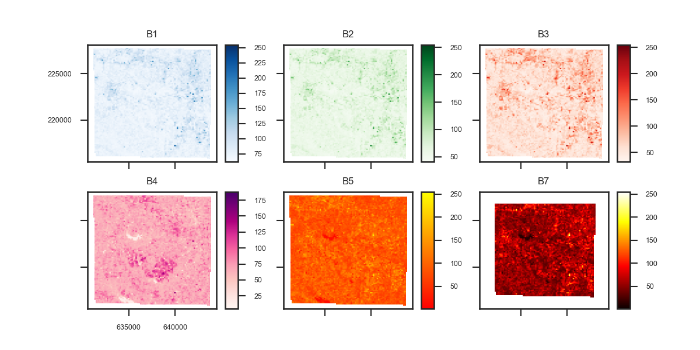

# Plotting

Both `Raster` and `RasterLayer` objects include basic plotting methods. The
plot method for a `RasterLayer` object produces a single raster plot using the
`matplotlib.pyplot.imshow` method.

For convenience, plot settings such as color ramps and stretches can also be
set for each RasterLayer using the `RasterLayer.cmap` that support matplotlib
cmap's, and the `RasterLayer.norm` attribute to associate a
`matplotlib.colors.Normalize` stretch with each RasterLayer:

To plot a single RasterLayer:

```
from pyspatialml import Raster
from pyspatialml.datasets import nc

stack = Raster([nc.band1, nc.band2, nc.band3, nc.band4, nc.band5, nc.band7])

# set RasterLayer color table
stack.lsat7_2000_10.cmap = "plasma"

# plot a single layer using an existing axis
fig, ax = plt.subplots()
stack.lsat7_2000_10.plot(ax=ax)
plt.show()
```



For RasterLayers that represent categorical data types, e.g. land cover, then
the `RasterLayer.categorical=True` attribute will cause the cmap to be
converted to a discrete scale.

The default plot method for a `Raster` object produces a raster-matrix plot of
the individual RasterLayers. By default this plot preserves the plotting
attributes of the individual rasters:

Plot all RasterLayers in a Raster object:

```
stack.lsat7_2000_10.cmap = "Blues"
stack.lsat7_2000_20.cmap = "Greens"
stack.lsat7_2000_30.cmap = "Reds"
stack.lsat7_2000_40.cmap = "RdPu"
stack.lsat7_2000_50.cmap = "autumn"
stack.lsat7_2000_70.cmap = "hot"

stack.plot(
    title_fontsize=8,
    label_fontsize=6,
    legend_fontsize=6,
    names=["B1", "B2", "B3", "B4", "B5", "B7"],
    fig_kwds={"figsize": (8, 4)},
    subplots_kwds={"wspace": 0.3}
)
plt.show()
```



The `Raster.plot` method also provides `cmap` and `norm` arguments that can be
used to override the settings of the individual RasterLayers. Additional
settings can be passed to control plot layout using the `figure_kwds`,
`legend_kwds` and `subplots_kwds` arguments.
